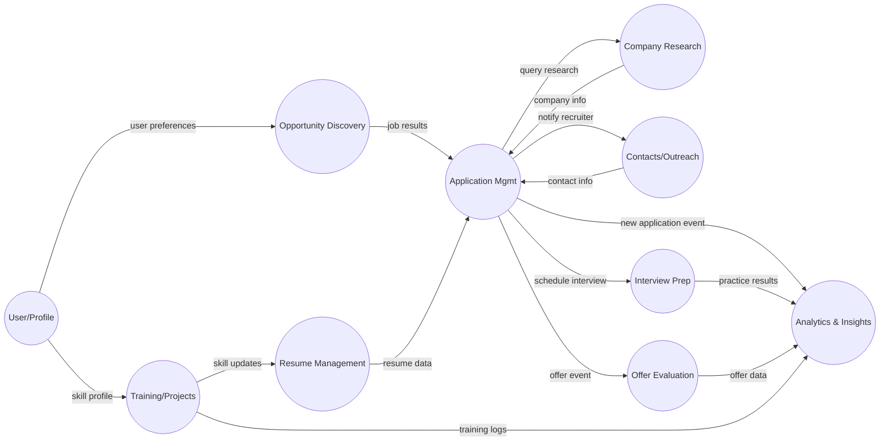

# Domain Model for jobops

**Executive Summary:** *jobops* is an AI-driven job search “command center” decomposed into multiple bounded contexts, each encapsulating a cohesive subset of the job-search workflow. Using Domain-Driven Design (DDD) principles, we define contexts that map to business capabilities such as discovering opportunities, managing applications, generating resumes, preparing for interviews, and so on【10†L93-L100】.  Each context has its own ubiquitous language and model, minimizing shared state and coupling. The architecture leans on microservices (or a modular monolith) with event-driven integration and AI agents (sub-agents) per domain.  This report outlines the context map, detailed context decomposition (entities, aggregates, services, commands/events), context interactions, mapping of user modes to contexts, suggested architecture patterns, and potential boundary risks.  

### 1. High-Level Context Map

【18†embed_image】 *Figure: Bounded contexts encapsulate distinct domain capabilities【10†L93-L100】.* The *jobops* system is partitioned into the following bounded contexts, each aligned to a specific aspect of the job-search domain:

| **Context**               | **Description**                                                                          |
|---------------------------|------------------------------------------------------------------------------------------|
| **Opportunity Discovery** | Discover and aggregate job postings from portals and boards (search/scan jobs).         |
| **Application Management**| Manage job applications and pipeline: apply, track status, schedule follow-ups.         |
| **Resume Management**     | Create and maintain ATS-optimized CVs and PDFs from user profile data.                  |
| **Company Research**      | Fetch deep company profiles, ratings, news and culture insights for target companies.    |
| **Interview Preparation** | Generate interview questions, practice sessions, and feedback for roles.                |
| **Contacts & Outreach**   | Manage recruiter/LinkedIn contacts, send outreach messages, and log responses.          |
| **Training & Projects**   | Track training courses, certifications, portfolio projects; recommend skill improvements. |
| **Offer Evaluation**      | Score and compare job offers (salary, benefits, location, etc.).                        |
| **Analytics & Insights**  | Analyze outcomes (rejection patterns, pipeline metrics, career progression).            |
| **User/Profile**          | Core user profile, preferences, credentials and settings (shared model).                |

Each context has a well-defined boundary and language, ensuring services remain **cohesive and loosely coupled**【19†L1-L4】【10†L93-L100】. For example, the Opportunity Discovery context defines “JobPosting”, “SearchQuery”, and “JobBoard” terms, while the Application context uses “Application”, “PipelineStage”, and “Status” terms.  

### 2. Detailed Context Breakdown

#### Opportunity Discovery Context
- **Purpose:** Search and aggregate job opportunities across portals and job boards (modes: `scan`, `batch`, `ofertas`). It centralizes search criteria (keywords, location, company) and returns relevant job listings.
- **Owned Concepts:** `JobPosting`, `JobBoard`, `SearchQuery`, `Location`, `SalaryRange`, `Industry`.
- **Key Aggregates:** *JobSearch* (aggregate root for a search session, holding criteria and results).
- **Entities:** `JobPosting` (fields: id, title, company, location, salary, sourceURL), `JobBoard` (source metadata).
- **Value Objects:** `SearchFilter` (keyword list, location, remote flag, salary range), `Pagination`, `Tag`.
- **Domain Services:** `JobScanner` (scrapes or queries multiple job APIs), `JobFilter` (ranks and filters postings by user criteria/ATS keywords).
- **Commands / Use Cases:** *SearchJobs*, *BatchSearchJobs* (initiate scan by keywords/filters), *AddSavedJob* (save posting to pipeline).
- **Events Produced:** `JobsDiscovered` (new postings found), `SearchCompleted`.
- **Events Consumed:** None internally; may consume `ProfileUpdated` (to refine search preferences), or third-party job feed events via ACL (see context mapping).

#### Application Management Context
- **Purpose:** Track and manage job applications from submission through interview to outcome (modes: `apply`, `tracker`, `pipeline`, `followup`). Automates form filling and status updates.
- **Owned Concepts:** `Application`, `Company`, `PipelineStage`, `Status`, `InterviewSlot`.
- **Key Aggregates:** *Application* (root holding job, company, resume reference, status, notes).
- **Entities:** `Application` (fields: id, jobPostingId, companyId, resumeId, appliedDate, status), `Company`.
- **Value Objects:** `ApplicationStatus` (enum: Applied, Interviewing, Offered, Rejected, etc.), `ContactInfo`, `ApplicationScore`.
- **Domain Services:** `ApplicationService` (handles submission, status transitions), `FormAutofillService` (fills application forms), `FollowUpService` (schedules reminders).
- **Commands / Use Cases:** *SubmitApplication*, *UpdateStatus*, *ScheduleFollowUp*, *BatchApply*.
- **Events Produced:** `ApplicationSubmitted`, `StatusUpdated`, `InterviewScheduled`, `FollowUpScheduled`.
- **Events Consumed:** `JobsDiscovered` (to initiate application on a selected job), `ContactAdded` (to associate recruiter with application), `InterviewFeedbackReceived`.

#### Resume Management Context
- **Purpose:** Create and update user resumes/CVs and generate ATS-optimized PDF documents (mode: `pdf`). Uses profile and job data to tailor resumes.
- **Owned Concepts:** `Resume`, `CVTemplate`, `Section` (Experience, Education, Skills, etc.), `ATSKeyword`.
- **Key Aggregates:** *Resume* (root including personal info, experience list, education, skills).
- **Entities:** `Resume`, `EducationEntry`, `ExperienceEntry`.
- **Value Objects:** `ContactDetails`, `Skill`, `Certification`, `KeywordSet`.
- **Domain Services:** `ResumeGenerator` (compose resume from user profile and selected template), `ATSOptimizer` (analyze job posting and highlight keywords), `PDFRenderer`.
- **Commands / Use Cases:** *GenerateResume*, *UpdateResume*, *GetPDFVersion*, *OptimizeForJob*.
- **Events Produced:** `ResumeGenerated`, `ResumeUpdated`.
- **Events Consumed:** `ProfileUpdated` (regenerate resume when user info changes), `JobsDiscovered` (highlight keywords for next applications).

#### Company Research Context
- **Purpose:** Gather deep insights on companies (mode: `deep`). Fetches profiles, Glassdoor ratings, news, culture notes to aid application tailoring and interviews.
- **Owned Concepts:** `CompanyProfile`, `GlassdoorRating`, `NewsArticle`, `EmployerReview`.
- **Key Aggregates:** *Company* (root containing company metadata, reviews, ratings).
- **Entities:** `Company`, `Review`, `NewsArticle`.
- **Value Objects:** `Rating`, `Sentiment`, `CoverageScore`.
- **Domain Services:** `ResearchService` (queries third-party APIs or scrapers), `SentimentAnalyzer` (extracts tone from reviews/news).
- **Commands / Use Cases:** *FetchCompanyProfile*, *FetchNews*, *AnalyzeSentiment*.
- **Events Produced:** `CompanyProfileFetched`, `NewsFetched`.
- **Events Consumed:** `ApplicationSubmitted` (trigger deep research on target company), `JobDiscovered` (fetch company info on new postings).

#### Interview Preparation Context
- **Purpose:** Prepare user for interviews (mode: `interview-prep`). Generates practice questions based on position and user resume, conducts mock interviews, and provides feedback.
- **Owned Concepts:** `InterviewQuestion`, `PracticeSession`, `Answer`, `Feedback`.
- **Key Aggregates:** *InterviewSession* (root tracking a scheduled practice interview).
- **Entities:** `Question`, `Answer`, `InterviewSession`.
- **Value Objects:** `Topic`, `DifficultyLevel`, `FeedbackScore`.
- **Domain Services:** `QuestionGenerator` (generates Q&A from job description or skillset), `CoachEngine` (evaluates answers, provides tips).
- **Commands / Use Cases:** *StartPracticeInterview*, *AnswerQuestion*, *GetFeedback*.
- **Events Produced:** `InterviewStarted`, `AnswerRecorded`, `FeedbackReady`.
- **Events Consumed:** `ApplicationMovedToInterview` (if tracked, schedule practice when interview set), `ResumeGenerated` (to tailor questions).

#### Contacts & Outreach Context
- **Purpose:** Manage professional contacts (LinkedIn, recruiters) and orchestrate outreach (modes: `contacto`, `followup`). Tracks messages and relationships.
- **Owned Concepts:** `Contact`, `Recruiter`, `MessageTemplate`, `OutreachLog`.
- **Key Aggregates:** *Contact* (root for an individual contact record).
- **Entities:** `Contact` (fields: id, name, source (LinkedIn/email), currentRole), `Message` (template or sent message).
- **Value Objects:** `Channel` (enum: LinkedIn, Email, Phone), `MessageContent`, `ResponseStatus`.
- **Domain Services:** `ContactService` (import/sync contacts), `OutreachService` (send messages via channels).
- **Commands / Use Cases:** *AddContact*, *SendMessage*, *ScheduleFollowUp*.
- **Events Produced:** `ContactImported`, `MessageSent`, `FollowUpReminder`.
- **Events Consumed:** `ApplicationSubmitted` (to notify recruiter or hiring manager), `UserAddedContact` (UI event).

#### Training & Projects Context
- **Purpose:** Track learning (courses, certifications) and portfolio projects; recommend new skills or content (modes: `training`, `project`).
- **Owned Concepts:** `Course`, `Certification`, `Project`, `Skill`.
- **Key Aggregates:** *Portfolio* (root containing user’s projects and certifications).
- **Entities:** `Course`, `Project`, `Certification`.
- **Value Objects:** `SkillLevel`, `Recommendation`.
- **Domain Services:** `RecommendationEngine` (suggest training based on job targets), `SkillTracker`.
- **Commands / Use Cases:** *AddCourse*, *AddProject*, *GetRecommendations*.
- **Events Produced:** `CourseCompleted`, `ProjectAdded`, `SkillLevelUpgraded`.
- **Events Consumed:** `ApplicationRejected` (to suggest training for missing skills), `ProfileUpdated` (to update skill profile).

#### Offer Evaluation Context
- **Purpose:** Score and compare job offers (mode: `oferta`). Evaluates compensation, benefits, culture fit, location, etc., producing an overall grade (A–F).
- **Owned Concepts:** `JobOffer`, `CompensationPackage`, `Benefit`.
- **Key Aggregates:** *Offer* (root capturing salary, bonus, equity, perks).
- **Entities:** `Offer` (fields: baseSalary, bonus, equity, benefits list, relocationBudget).
- **Value Objects:** `Salary`, `Equity`, `BenefitItem`, `Location`.
- **Domain Services:** `OfferScorer` (weights and scores offer components), `CompensationComparator`.
- **Commands / Use Cases:** *EvaluateOffer*, *CompareOffers*.
- **Events Produced:** `OfferEvaluated` (score and recommendation).
- **Events Consumed:** `OfferAccepted`/`OfferDeclined` (to update analytics), `ApplicationOutcome` (if integrated with HR systems).

#### Analytics & Insights Context
- **Purpose:** Analyze outcomes and metrics (mode: `patterns`). Generates insights on rejection patterns, application success rates, pipeline performance, and career progression.
- **Owned Concepts:** `RejectionPattern`, `Metric`, `CareerGoal`, `Progress`.
- **Key Aggregates:** *AnalyticsReport* (root containing various metrics and patterns).
- **Entities:** `RejectionRecord`, `Goal`, `InterviewFeedback`.
- **Value Objects:** `PatternStats`, `GoalStatus`, `Trend`.
- **Domain Services:** `AnalyticsEngine` (aggregates event data, finds correlations), `VisualizationService`.
- **Commands / Use Cases:** *AnalyzeRejections*, *ComputeProgress*, *GenerateReport*.
- **Events Produced:** `RejectionPatternDetected`, `ProgressMilestoneReached`.
- **Events Consumed:** `ApplicationSubmitted` (track successes/failures), `ApplicationRejected`, `OfferEvaluated`, `ProfileUpdated`.

#### User/Profile Context
- **Purpose:** Core context for user identity, profile data, preferences and credentials. Shared by most other contexts to provide personalization.
- **Owned Concepts:** `User`, `Profile`, `Preference`, `Credential`.
- **Key Aggregates:** *User* (root with personal and account information).
- **Entities:** `User` (id, name, email, auth info), `Preference` (fields: industries, locations, salary range, notifications).
- **Value Objects:** `ContactInfo`, `EducationEntry`, `ExperienceEntry`.
- **Domain Services:** `ProfileManager` (CRUD on user profile), `AuthService` (JWT token handling).
- **Commands / Use Cases:** *UpdateProfile*, *SetPreferences*, *Authenticate*.
- **Events Produced:** `ProfileUpdated`, `PreferencesChanged`, `UserRegistered`.
- **Events Consumed:** `ResumeGenerated` (update profile with new skills), `CourseCompleted` (update skills), `ApplicationSubmitted` (update experience).

### 3. Context Relationships

Contexts interact via well-defined APIs and domain events. The **data flow** is largely event-driven (async messaging) with occasional synchronous calls for queries. Below is a simplified context interaction diagram:



*Figure: Context interactions (arrows show data/events flow).* Integration uses patterns like Published Language and Anti-Corruption Layers (ACLs)【17†L118-L125】. For example, the Opportunity Discovery context consumes external job feeds via adapters (ACL) to translate into its own `JobPosting` model. Similarly, other services may expose well-documented REST or messaging APIs (Open Host Service pattern) for loose coupling【17†L139-L146】.  

Communication is mix of **synchronous REST/HTTP APIs** (for on-demand requests, e.g. fetching a company profile) and **asynchronous events** (for workflows and decoupling). For example, when a user submits an application, the Application context emits an `ApplicationSubmitted` event that downstream contexts (Analytics, Contacts, InterviewPrep) consume. This event-driven approach allows contexts to operate independently【15†L133-L139】. Each context acts as either an **upstream** or **downstream** party in interactions: e.g., UserProfile is upstream of OpportunityDiscovery (providing preferences), whereas Analytics is downstream of most events.

### 4. Mapping to jobops Modes

Each command-line mode maps to one or more bounded contexts as follows:

| **Mode**          | **Context(s)**                  |
|-------------------|---------------------------------|
| `scan`            | Opportunity Discovery           |
| `ofertas`         | Opportunity Discovery (filter by offers) |
| `batch`           | Opportunity Discovery / Application Management |
| `apply`           | Application Management          |
| `pipeline`        | Application Management          |
| `tracker`         | Application Management          |
| `followup`        | Application Management / Contacts |
| `contacto`        | Contacts & Outreach             |
| `pdf`             | Resume Management               |
| `training`        | Training & Projects             |
| `project`         | Training & Projects             |
| `interview-prep`  | Interview Preparation           |
| `deep`            | Company Research                |
| `oferta`          | Offer Evaluation                |
| `patterns`        | Analytics & Insights            |
| `update`          | User/Profile (profile update)   |

For example, `scan` invokes the OpportunityDiscovery service to retrieve jobs; `apply` triggers ApplicationManagement to submit an application; `training` queries the Training context, and so forth. This mapping ensures modes directly invoke the appropriate bounded context(s).

### 5. Suggested Architecture

- **Microservices (or Modular Monolith):** Each context can be a separate service (database-per-service) to enforce isolation. For scale and independent deployability, microservices per bounded context are recommended【10†L93-L100】. A modular monolith is acceptable initially but must evolve into microservices as complexity grows, avoiding a “distributed monolith” trap.
- **API-First & Contracts:** Define synchronous REST APIs (OpenAPI 3.1) for each service’s public interface, and AsyncAPI (or webhook schemas) for events. Security via JWT Bearer tokens (oauth2/jwt) for auth across services. Contract testing should verify adherence.
- **Event-Driven Integration:** Use an asynchronous message bus (e.g. Kafka/RabbitMQ) for domain events (ApplicationSubmitted, OfferEvaluated, etc.). This decouples services and enables workflows/pipelines. Event payloads follow published schema contracts. (Async APIs ensure each context processes events on its own schedule【15†L133-L139】.)
- **AI Agents/Sub-Agents:** Given AI-first, each context may host specialized AI sub-agents or inference services (e.g. an NLP agent for Resume generation, a chat-based Interview Coach, a scraping agent for jobs). A workflow orchestrator (orchestrating sagas) can coordinate these AI agents across contexts.
- **Scalability & Async Pipelines:** Design long-running processes as background jobs. E.g., bulk scanning of job boards (`batch`), or analyzing rejection patterns, run asynchronously with proper queuing. UI/actions trigger events and check status via APIs.
- **Extensibility:** New contexts (modes) can be added by defining a new bounded context and integrating via the event bus or API. For example, adding a “Mentorship” context would simply subscribe to relevant events and publish new ones.
- **Service Mesh/Observability:** As services multiply, use service mesh (e.g. Istio) for advanced routing and tracing. Employ distributed tracing/logging for end-to-end visibility of multi-context workflows.

This architecture aligns with best practices: bounded contexts define service boundaries【10†L93-L100】, communication uses standardized APIs, and asynchronous events connect the domains【10†L153-L158】【15†L133-L139】. The result is a scalable, resilient system where each microservice mirrors a real-world business capability.

### 6. Risks & Boundary Smells

- **Boundary Creep (“God Context”):** Danger of aggregating too much functionality into one context (e.g. putting Contacts logic into Application context). Mitigation: adhere to the ubiquitous language and single-responsibility per context【19†L1-L4】, and split if a service grows beyond a coherent purpose.
- **Leaky Abstractions:** Directly using other context’s entities/DB can cause coupling. Use APIs/events (not shared tables) and consider an **Anti-Corruption Layer (ACL)** when interfacing with external systems or large legacy modules【17†L118-L125】.
- **Tight Coupling via APIs:** Overuse of synchronous calls (e.g. Application fetching company info synchronously) can create runtime dependencies. Favor async events or caching, and clearly document API contracts. In high-traffic paths (e.g. apply), avoid cross-service synchronous loops.
- **Ubiquitous Language Confusion:** If teams mix terms (e.g. “Job” meaning both internal pipeline record and external posting), misunderstandings arise. Maintain context-specific glossaries and avoid sharing entities across contexts. If needed, use translation or shared-kernel narrowly【17†L99-L107】【17†L118-L125】.
- **Over-Complex Event Flows:** Eventual consistency can be tricky (e.g. updating profile triggering chain of resume/regeneration). Document workflows and ensure idempotency. Consider sagas or compensating actions if multi-step processes fail.
- **Security Domain Crossing:** Each context must validate JWT tokens and enforce its own rules. Shared authentication (Auth server in User context) is upstream; all other contexts are downstream with ACL to that auth.
- **AI Risks:** Relying on AI subagents can introduce non-determinism. Constrain agents’ scope tightly (one per context) and treat them as domain services behind an API. Keep audit logs of AI actions.
- **Data Privacy & Compliance:** Contacts, resumes, and profiles contain personal data. Bound contexts should limit PII exposure; e.g., Contacts context should not expose recruiter contact to unrelated contexts.
- **Scaling Hotspots:** Some aggregates (e.g. AnalyticsReport) may become bottlenecks if not partitioned. Use event sourcing or CQRS for analytics to offload reads from transactional flows.

By monitoring for these “boundary smells” (e.g. duplicated logic, ambiguous models) and applying DDD integration patterns (Partnership, Customer/Supplier, ACL) as needed【17†L118-L125】【17†L139-L146】, the architecture remains robust and maintainable.

### 7. API Definitions (OpenAPI 3.1)

Below are concise OpenAPI YAML skeletons for each context’s core API. These define security (JWT Bearer), main paths, request/response schemas, and example payloads. (Schemas focus on aggregates/entities.)

#### Opportunity Discovery API

```yaml
openapi: 3.1.0
info:
  title: Opportunity Discovery API
  version: 1.0.0
servers:
  - url: https://api.jobops.example.com/discovery
tags:
  - Opportunity
components:
  securitySchemes:
    BearerAuth:
      type: http
      scheme: bearer
  schemas:
    SearchRequest:
      type: object
      properties:
        keywords:
          type: array
          items: { type: string }
        location:
          type: string
        remote:
          type: boolean
        salaryRange:
          $ref: '#/components/schemas/SalaryRange'
      required: [keywords]
    SalaryRange:
      type: object
      properties:
        min: { type: integer, example: 50000 }
        max: { type: integer, example: 100000 }
    JobPosting:
      type: object
      properties:
        id: { type: string, example: "job-123" }
        title: { type: string }
        company: { type: string }
        location: { type: string }
        salary: { $ref: '#/components/schemas/SalaryRange' }
        description: { type: string }
        url: { type: string }
      required: [id, title, company, location, url]
    JobListResponse:
      type: object
      properties:
        jobs:
          type: array
          items:
            $ref: '#/components/schemas/JobPosting'
    JobSearch:
      type: object
      properties:
        queryId: { type: string }
        status: { type: string, enum: [“Pending”, “Complete”] }
        results: 
          type: array
          items: { $ref: '#/components/schemas/JobPosting' }
paths:
  /jobs/search:
    post:
      tags: [Opportunity]
      summary: Search for jobs by criteria
      security:
        - BearerAuth: []
      requestBody:
        content:
          application/json:
            schema:
              $ref: '#/components/schemas/SearchRequest'
      responses:
        '200':
          description: List of matching job postings
          content:
            application/json:
              schema:
                $ref: '#/components/schemas/JobListResponse'
  /jobs/search/{queryId}:
    get:
      tags: [Opportunity]
      summary: Get status/results of an asynchronous search
      security:
        - BearerAuth: []
      parameters:
        - name: queryId
          in: path
          schema: { type: string }
      responses:
        '200':
          content:
            application/json:
              schema:
                $ref: '#/components/schemas/JobSearch'
  /jobs/{jobId}:
    get:
      tags: [Opportunity]
      summary: Retrieve a single job posting
      security:
        - BearerAuth: []
      parameters:
        - name: jobId
          in: path
          schema: { type: string }
      responses:
        '200':
          content:
            application/json:
              schema:
                $ref: '#/components/schemas/JobPosting'
```

#### Application Management API

```yaml
openapi: 3.1.0
info:
  title: Application Management API
  version: 1.0.0
servers:
  - url: https://api.jobops.example.com/applications
tags:
  - Application
components:
  securitySchemes:
    BearerAuth: { type: http, scheme: bearer }
  schemas:
    Application:
      type: object
      properties:
        id: { type: string }
        jobId: { type: string }
        company: { type: string }
        appliedDate: { type: string, format: date }
        status: { type: string, enum: [Applied, Interviewing, Offered, Rejected] }
        resumeId: { type: string }
        notes: { type: string }
      required: [id, jobId, company, appliedDate, status]
    CreateApplicationRequest:
      type: object
      properties:
        jobId: { type: string }
        resumeId: { type: string }
        company: { type: string }
      required: [jobId, resumeId, company]
    StatusUpdate:
      type: object
      properties:
        status: { type: string, enum: [Applied, Interviewing, Offered, Rejected] }
      required: [status]
    FollowUpRequest:
      type: object
      properties:
        applicationId: { type: string }
        date: { type: string, format: date }
        note: { type: string }
      required: [applicationId, date]
paths:
  /applications:
    get:
      tags: [Application]
      summary: List all user applications
      security: [BearerAuth]
      responses:
        '200':
          content:
            application/json:
              schema:
                type: array
                items: { $ref: '#/components/schemas/Application' }
    post:
      tags: [Application]
      summary: Submit a new job application
      security: [BearerAuth]
      requestBody:
        content:
          application/json:
            schema:
              $ref: '#/components/schemas/CreateApplicationRequest'
      responses:
        '201':
          content:
            application/json:
              schema: { $ref: '#/components/schemas/Application' }
  /applications/{appId}/status:
    put:
      tags: [Application]
      summary: Update application status
      security: [BearerAuth]
      parameters:
        - name: appId
          in: path
          schema: { type: string }
      requestBody:
        content:
          application/json:
            schema:
              $ref: '#/components/schemas/StatusUpdate'
      responses:
        '200':
          content:
            application/json:
              schema: { $ref: '#/components/schemas/Application' }
  /followups:
    post:
      tags: [Application]
      summary: Schedule a follow-up for an application
      security: [BearerAuth]
      requestBody:
        content:
          application/json:
            schema:
              $ref: '#/components/schemas/FollowUpRequest'
      responses:
        '202':
          description: Follow-up scheduled
```

#### Resume Management API

```yaml
openapi: 3.1.0
info:
  title: Resume Management API
  version: 1.0.0
servers:
  - url: https://api.jobops.example.com/resumes
tags:
  - Resume
components:
  securitySchemes:
    BearerAuth: { type: http, scheme: bearer }
  schemas:
    Resume:
      type: object
      properties:
        id: { type: string }
        userId: { type: string }
        name: { type: string }
        experiences:
          type: array
          items:
            $ref: '#/components/schemas/Experience'
        education:
          type: array
          items:
            $ref: '#/components/schemas/Education'
        skills:
          type: array
          items: { type: string }
      required: [id, userId, name]
    Experience:
      type: object
      properties:
        company: { type: string }
        title: { type: string }
        startDate: { type: string, format: date }
        endDate: { type: string, format: date }
      required: [company, title, startDate]
    Education:
      type: object
      properties:
        institution: { type: string }
        degree: { type: string }
        year: { type: integer }
      required: [institution, degree]
    GenerateRequest:
      type: object
      properties:
        templateId: { type: string }
        targetJobId: { type: string }
      required: [templateId]
paths:
  /resumes:
    get:
      tags: [Resume]
      summary: Get user resumes
      security: [BearerAuth]
      responses:
        '200':
          content:
            application/json:
              schema:
                type: array
                items: { $ref: '#/components/schemas/Resume' }
    post:
      tags: [Resume]
      summary: Generate a new resume
      security: [BearerAuth]
      requestBody:
        content:
          application/json:
            schema:
              $ref: '#/components/schemas/GenerateRequest'
      responses:
        '201':
          content:
            application/json:
              schema: { $ref: '#/components/schemas/Resume' }
  /resumes/{resumeId}/pdf:
    get:
      tags: [Resume]
      summary: Get resume as PDF
      security: [BearerAuth]
      parameters:
        - name: resumeId
          in: path
          schema: { type: string }
      responses:
        '200':
          content:
            application/pdf:
              schema: { type: string, format: binary }
```

#### Company Research API

```yaml
openapi: 3.1.0
info:
  title: Company Research API
  version: 1.0.0
servers:
  - url: https://api.jobops.example.com/companies
tags:
  - Company
components:
  securitySchemes:
    BearerAuth: { type: http, scheme: bearer }
  schemas:
    CompanyProfile:
      type: object
      properties:
        id: { type: string }
        name: { type: string }
        description: { type: string }
        rating: { type: number }
        industry: { type: string }
        website: { type: string }
      required: [id, name]
    NewsArticle:
      type: object
      properties:
        title: { type: string }
        summary: { type: string }
        url: { type: string }
        publishedDate: { type: string, format: date }
      required: [title, url]
paths:
  /companies/{companyId}/profile:
    get:
      tags: [Company]
      summary: Fetch company profile and reviews
      security: [BearerAuth]
      parameters:
        - name: companyId
          in: path
          schema: { type: string }
      responses:
        '200':
          content:
            application/json:
              schema: { $ref: '#/components/schemas/CompanyProfile' }
  /companies/{companyId}/news:
    get:
      tags: [Company]
      summary: Fetch recent news articles about the company
      security: [BearerAuth]
      parameters:
        - name: companyId
          in: path
          schema: { type: string }
      responses:
        '200':
          content:
            application/json:
              schema:
                type: array
                items: { $ref: '#/components/schemas/NewsArticle' }
```

#### Interview Preparation API

```yaml
openapi: 3.1.0
info:
  title: Interview Preparation API
  version: 1.0.0
servers:
  - url: https://api.jobops.example.com/interview
tags:
  - Interview
components:
  securitySchemes:
    BearerAuth: { type: http, scheme: bearer }
  schemas:
    Question:
      type: object
      properties:
        id: { type: string }
        text: { type: string }
        topic: { type: string }
      required: [id, text]
    InterviewSession:
      type: object
      properties:
        sessionId: { type: string }
        status: { type: string }
      required: [sessionId, status]
paths:
  /interview/questions:
    get:
      tags: [Interview]
      summary: Get mock interview questions for a job
      security: [BearerAuth]
      parameters:
        - name: jobId
          in: query
          schema: { type: string }
      responses:
        '200':
          content:
            application/json:
              schema:
                type: array
                items: { $ref: '#/components/schemas/Question' }
  /interview/start:
    post:
      tags: [Interview]
      summary: Start an interview practice session
      security: [BearerAuth]
      responses:
        '200':
          content:
            application/json:
              schema: { $ref: '#/components/schemas/InterviewSession' }
```

#### Contacts & Outreach API

```yaml
openapi: 3.1.0
info:
  title: Contacts & Outreach API
  version: 1.0.0
servers:
  - url: https://api.jobops.example.com/contacts
tags:
  - Contacts
components:
  securitySchemes:
    BearerAuth: { type: http, scheme: bearer }
  schemas:
    Contact:
      type: object
      properties:
        id: { type: string }
        name: { type: string }
        role: { type: string }
        company: { type: string }
        channel: { type: string, enum: [LinkedIn, Email, Phone] }
      required: [id, name, channel]
    Message:
      type: object
      properties:
        to: { type: string }
        content: { type: string }
      required: [to, content]
paths:
  /contacts:
    get:
      tags: [Contacts]
      summary: List all contacts
      security: [BearerAuth]
      responses:
        '200':
          content:
            application/json:
              schema:
                type: array
                items: { $ref: '#/components/schemas/Contact' }
    post:
      tags: [Contacts]
      summary: Add a new contact
      security: [BearerAuth]
      requestBody:
        content:
          application/json:
            schema: { $ref: '#/components/schemas/Contact' }
      responses:
        '201':
          content:
            application/json:
              schema: { $ref: '#/components/schemas/Contact' }
  /messages/send:
    post:
      tags: [Contacts]
      summary: Send outreach message to a contact
      security: [BearerAuth]
      requestBody:
        content:
          application/json:
            schema: { $ref: '#/components/schemas/Message' }
      responses:
        '200':
          description: Message queued for sending
```

#### Training & Projects API

```yaml
openapi: 3.1.0
info:
  title: Training & Projects API
  version: 1.0.0
servers:
  - url: https://api.jobops.example.com/training
tags:
  - Training
components:
  securitySchemes:
    BearerAuth: { type: http, scheme: bearer }
  schemas:
    Course:
      type: object
      properties:
        id: { type: string }
        title: { type: string }
        provider: { type: string }
        url: { type: string }
      required: [id, title]
    Project:
      type: object
      properties:
        id: { type: string }
        name: { type: string }
        description: { type: string }
      required: [id, name]
    Recommendation:
      type: object
      properties:
        type: { type: string, enum: [Course, Project] }
        id: { type: string }
        reason: { type: string }
      required: [type, id, reason]
paths:
  /courses:
    get:
      tags: [Training]
      summary: List recommended courses
      security: [BearerAuth]
      responses:
        '200':
          content:
            application/json:
              schema:
                type: array
                items: { $ref: '#/components/schemas/Course' }
  /projects:
    get:
      tags: [Training]
      summary: List portfolio projects
      security: [BearerAuth]
      responses:
        '200':
          content:
            application/json:
              schema:
                type: array
                items: { $ref: '#/components/schemas/Project' }
  /recommendations:
    get:
      tags: [Training]
      summary: Get skill/course recommendations
      security: [BearerAuth]
      responses:
        '200':
          content:
            application/json:
              schema:
                type: array
                items: { $ref: '#/components/schemas/Recommendation' }
```

#### Offer Evaluation API

```yaml
openapi: 3.1.0
info:
  title: Offer Evaluation API
  version: 1.0.0
servers:
  - url: https://api.jobops.example.com/offers
tags:
  - Offer
components:
  securitySchemes:
    BearerAuth: { type: http, scheme: bearer }
  schemas:
    OfferRequest:
      type: object
      properties:
        baseSalary: { type: number }
        bonus: { type: number }
        equityValue: { type: number }
        benefits: 
          type: array
          items: { type: string }
      required: [baseSalary]
    OfferScore:
      type: object
      properties:
        score: { type: string, description: "Grade A-F" }
        breakdown: { type: object }
      required: [score]
paths:
  /offers/evaluate:
    post:
      tags: [Offer]
      summary: Evaluate a job offer and score it
      security: [BearerAuth]
      requestBody:
        content:
          application/json:
            schema: { $ref: '#/components/schemas/OfferRequest' }
      responses:
        '200':
          content:
            application/json:
              schema: { $ref: '#/components/schemas/OfferScore' }
```

#### Analytics & Insights API

```yaml
openapi: 3.1.0
info:
  title: Analytics & Insights API
  version: 1.0.0
servers:
  - url: https://api.jobops.example.com/analytics
tags:
  - Analytics
components:
  securitySchemes:
    BearerAuth: { type: http, scheme: bearer }
  schemas:
    PatternReport:
      type: object
      properties:
        pattern: { type: string }
        count: { type: integer }
      required: [pattern, count]
    ProgressReport:
      type: object
      properties:
        metric: { type: string }
        value: { type: number }
      required: [metric, value]
paths:
  /analytics/rejections:
    get:
      tags: [Analytics]
      summary: Analyze rejection patterns
      security: [BearerAuth]
      responses:
        '200':
          content:
            application/json:
              schema:
                type: array
                items: { $ref: '#/components/schemas/PatternReport' }
  /analytics/progression:
    get:
      tags: [Analytics]
      summary: Get career progression metrics
      security: [BearerAuth]
      responses:
        '200':
          content:
            application/json:
              schema:
                $ref: '#/components/schemas/ProgressReport'
```

Each API’s schemas and paths above provide the **skeleton** for core operations. In a real implementation, additional fields, error responses, and pagination would be included. All APIs use a common JWT Bearer scheme for authentication.

### References

- Evans, E. *Domain-Driven Design* – strategic DDD and bounded contexts【10†L93-L100】.  
- AsyncAPI Initiative, “A straight guide to APIs…” – asynchronous/event-driven API patterns【15†L133-L139】.  
- Chen Chen, *Context Mapping in DDD* – upstream/downstream and anti-corruption patterns【17†L118-L125】【17†L139-L146】.  
- TekRecruiter, *Microservices Best Practices* – DDD service decomposition, API-first, AsyncAPI【10†L153-L158】【19†L1-L4】.  

